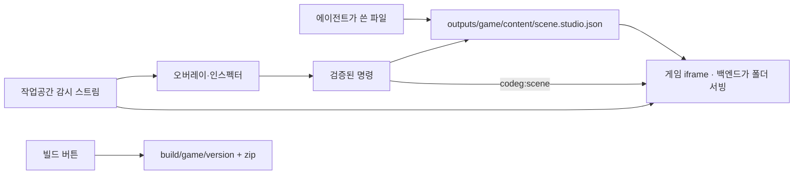

# Content Studio — 첫 구현

이 문서는 기능 변경과 함께 유지관리한다. 시각 계획의 정본은 [roadmap.json](./roadmap.json)이며, [시각 계획표](../../public/studio-plan.html)는 자동 생성 결과다.

## 목적과 첫 세트

게임·인터랙티브 웹·강의 콘텐츠에 사용할 제작 기반을 검증한다.

| 층 | 현재 구현 | 경계 |
| --- | --- | --- |
| 문서 | 엔진과 편집기가 공유하는 장면 파일 `outputs/game/content/<scene>.studio.json`, 검증된 명령, etag 저장 | 프로젝트 폴더 안에서만 |
| 도구 | iframe 위 오버레이로 선택·드래그, 인스펙터(transform·props), 장면 추가·전환 | 이미지 업로드·타일맵·타임라인은 후속 |
| 엔진 | 게임 자체(`outputs/game/index.html`)를 백엔드가 서빙, 편집기는 별도 렌더러 없음 | `codeg:ready` / `codeg:scene` 계약을 지키는 엔진 |
| 배포 | 빌드 버튼 → `build/game/<version>/` + zip | 정적 호스팅에 올리는 것은 사용자 |

## 실행 — 전체 빌드 없이 미리보기

```sh
pnpm install
pnpm dev
```

- 편집기: 작업공간에서 프로젝트 폴더를 열고 빠른 작업 → 콘텐츠 스튜디오. `?path` 없는 `/studio`는 안내만 보여 준다(브라우저 초안 모드는 없어졌다).
- 시각 계획: `http://localhost:3100/studio-plan.html`
- 어떻게 만들었나(인터랙티브): `http://localhost:3100/how-built.html` — 편집기 헤더와 빠른 작업 메뉴의 버튼. 원본은 `docs/studio/how-built.json`.
- 기존 앱: 작업공간 하단 빠른 작업 메뉴 → 콘텐츠 스튜디오, 또는 창작 스튜디오 탭 → Studio 열기. 활성 폴더가 있으면 대화 옆 파일 창에 파인으로 열리고 그 폴더의 `outputs/game/content/`에 저장한다. 폴더가 없으면 `/studio` 단독 페이지.
- 편집기 안의 변경은 즉시 렌더링한다. 코드 변경은 Next 개발 서버가 반영한다.
- 배포할 때 `pnpm build`로 정적 파일을 생성한다. Studio는 Next 서버 API를 사용하지 않는다.

## 개발 루프 — 빌드 없이 변경을 바로 본다

| 목적 | 명령 | 반영 속도 |
| --- | --- | --- |
| 프런트엔드만 (시작 화면 UI, /studio 안내 화면) | `pnpm dev` → `http://localhost:3100` | 저장 즉시 HMR |
| 프런트엔드 + 실제 백엔드 (장면 저장, 게임 미리보기, 빌드) | 터미널 1: `pnpm server:dev` (또는 `CODEG_TOKEN=dev ./src-tauri/target/debug/codeg-server`) · 터미널 2: `pnpm dev:web` → `http://localhost:3100/login`에서 토큰 입력 | 프런트 즉시, Rust는 `cargo run` 재실행(증분 컴파일) |
| 데스크톱 창 그대로 | `pnpm tauri dev` | 프런트 즉시(HMR), Rust 변경 시 자동 재빌드 |

`pnpm dev:web`은 `NEXT_PUBLIC_CODEG_API_URL=http://127.0.0.1:3081`로 웹 트랜스포트를 별도 서버에 붙인다(서버 CORS 허용, WebSocket은 origin 제한 없음). 배포 빌드에는 이 변수를 넣지 않는다. `pnpm build` + 바이너리 실행은 배포 전 최종 확인용이다.

## 확인 흐름

1. 창작 스튜디오 탭 → 새 콘텐츠 프로젝트(web-three) → 작업공간이 열리면 빠른 작업 → 콘텐츠 스튜디오.
2. 스캐폴드된 `main` 장면이 게임 iframe에 그려진다. `hero`를 드래그하면 즉시 움직이고 0.5초 뒤 파일에 저장된다.
3. 미리보기를 누르고 주인공을 클릭하면 `logic.actions.act_hero`가 실행돼 힌트 텍스트가 토글된다. 편집으로 돌아오면 원본은 그대로다.
4. 대화창에서 에이전트에게 장면을 고치게 한다. 저장되는 순간 편집기가 다시 읽고 iframe이 갱신된다. 편집 중이었다면 배너가 뜬다.
5. 빌드를 누르면 `build/game/v1-…/`와 zip이 생기고 사이드바에 버전이 보인다.
6. 명령 작업공간에서 JSON 명령을 적용하고 한 번에 실행 취소한다.

## 저장

- 장면은 프로젝트 폴더의 `outputs/game/content/<scene>.studio.json` 하나뿐이다. 브라우저 저장소(IndexedDB)와 번들 내보내기는 없어졌다. git이 이력이다.
- 저장은 백엔드 etag를 싣는다. 디스크가 바뀌었으면 거부되고 메모리의 편집은 유지된다. 감시 스트림이 그 변경을 알리면 편집 중이 아닐 때는 자동으로 다시 읽는다.
- 실행 취소는 메모리에 최대 50단계다.
- 편집기는 자기가 아는 필드만 검증하고 나머지는 보존한다. 임의 스크립트·함수는 문서에 들어갈 수 없다.

## 에이전트와 공통 명령

에이전트는 장면 파일을 직접 편집하면 된다. 스키마는 생성된 `outputs/game/content/README.md`와 [project-layout.md](./project-layout.md)에 있다. 편집기 안의 명령 작업공간은 같은 검증기를 거치는 JSON 배치다.

```json
[
  { "type": "node.update", "id": "title", "transform": { "y": 260 }, "props": { "color": "#ffcc66" } },
  { "type": "node.add", "node": { "id": "sign", "parent": "root", "type": "rect",
      "transform": { "x": 100, "y": 100, "w": 300, "h": 200, "anchor": "top-left", "z": 5 },
      "props": { "color": "#6d7a8c" } } }
]
```

| 명령 | 내용 |
| --- | --- |
| `scene.update` | `name` |
| `node.add` | `node`: SceneNode 전체 |
| `node.update` | `id`, `transform`(부분), `props`(얕은 병합) |
| `node.remove` | `id`; 자식 노드도 함께 |
| `node.reorder` | `id`, `direction`: forward(맨 앞 z) 또는 backward(맨 뒤 z) |

- 명령은 전체 배치가 검증된 경우에만 적용된다. 실패하면 원본을 유지한다.
- 에이전트는 같은 명령을 MCP 도구로 쓴다. 콘텐츠 프로젝트 폴더에서 연 세션에는 codeg-mcp 동반 프로세스가 `studio_list_scenes`·`studio_read_scene`·`studio_apply_scene_commands`·`studio_build`를 노출한다. 검증기는 `src-tauri/src/studio_scene.rs`(이 문서의 `document.ts`와 같은 규칙)이고, 파일에 쓰면 편집기와 미리보기가 감시 스트림으로 알아챈다.
- 편집기 → 에이전트: 헤더의 **대화로 보내기**가 장면 파일 배지와 함께 현재 장면·선택한 노드·미리보기 런타임 오류를 옆 대화의 입력창에 넣는다. 전송은 사용자가 한다. 게임 보기의 오류 띠에도 같은 버튼이 있다.
- 미리보기 서버는 서빙하는 HTML에 오류 보고 스크립트를 주입한다(`codeg:error` postMessage). 엔진을 에이전트가 새로 썼더라도 예외·거부된 프로미스·`console.error`·리소스 로드 실패가 편집기에 뜬다. 빌드 산출물에는 들어가지 않는다.

## 구조



- `src/lib/studio/document.ts`: 장면 스키마 검증·명령·좌표 계산, 프로토타입 파일 변환.
- `src/lib/studio/project-storage.ts`: 장면 목록·읽기·저장·etag.
- `src/components/studio/studio-stage.tsx`: iframe + 드래그 오버레이 + 엔진 핸드셰이크.
- `src/components/studio/studio-workspace.tsx`: 편집기 화면, 감시 구독, 자동 저장, 빌드.
- `src-tauri/src/content_preview.rs`: 프로젝트 폴더 HTTP 서빙(공개 라우트 + 데스크톱 루프백), HTML에 오류 보고 스크립트 주입.
- `src-tauri/src/studio_scene.rs`, `studio_tools.rs`: 장면 검증·명령의 Rust 쌍둥이와 `studio_*` MCP 도구 구현. `acp/delegation/`의 companion·listener·transport가 연결한다.
- `src/lib/studio/agent-context.ts`, `src/components/studio/use-chat-bridge.ts`: 대화로 보내는 컨텍스트와 대화 입력창 연결.
- `src-tauri/src/commands/content_project.rs`: 스캐폴드, 매니페스트, 장면 목록, 빌드 패키징. `content_project_three_main.js`가 스캐폴드되는 러너.
- `src/components/studio/game-preview.tsx`, `studio-pane.tsx`: 작업공간 파일 창의 게임 보기/장면 편집 전환.

## 검증과 계획 유지관리

```sh
pnpm studio:plan
pnpm studio:plan:check
pnpm exec vitest run src/lib/studio src/i18n
pnpm lint src/app/studio src/components/studio src/lib/studio scripts/build-studio-plan.mjs
(cd src-tauri && cargo test --features test-utils content_)
pnpm exec tsc --noEmit
pnpm studio:test  # 별도 터미널에서 pnpm dev 실행 필요 (안내 화면만; 실제 루프는 codeg-server + 프로젝트로 확인)
pnpm build
```

기능 변경 시 같은 변경 묶음에서 다음을 수행한다.

1. `roadmap.json`의 단계 상태·완료 기준·경계·검증 결과를 업데이트한다.
2. 이 README의 사용법·명령·제약이 구현과 맞는지 확인한다.
3. `pnpm studio:plan`으로 시각 계획을 생성한다.
4. `pnpm studio:plan:check`로 문서 동기화를 확인한다.

실제 검증 결과는 roadmap.json의 checks에 기록한다. 검증하지 않은 항목을 완료로 표시하지 않는다.

브라우저 검증은 설치된 Chrome을 사용한다. 다른 실행 환경에서는 `STUDIO_BROWSER`를 지정할 수 있으며, 서버 주소는 `STUDIO_URL`로 바꾼다.

Node 26에서 jsdom 테스트가 전역 localStorage 충돌로 실패하면 `NODE_OPTIONS=--no-experimental-webstorage pnpm test`를 사용한다. 제품 코드 변경 없이 테스트 런타임의 중복 Web Storage를 비활성화한다.

## 현재 검증 상태

2026-09-19 기준 전체 린트, TypeScript, 정적 빌드가 통과했다. Vitest 456개 파일 / 6,632개 테스트와 실제 Chrome 브라우저 시나리오 3개가 통과했다. 브라우저 시나리오는 렌더 픽셀, 클릭 동작, 드래그·명령·실행 취소, 이미지 번들과 새로고침 복원, 모바일 및 한국어·어두운 테마를 확인한다. 상세 기록은 시각 계획의 검증 기록을 참조한다.

## 콘텐츠 프로젝트

새 게임·새 웹툰이 아니라 **콘텐츠 프로젝트** 하나를 만든다. 세계관·캐릭터·스토리(`bible/`)를 정본으로 두고 `outputs/` 아래 game·webtoon·instatoon·novel·video를 선택해 생성한다. 폴더 규칙과 매니페스트는 [project-layout.md](./project-layout.md)에 있다.

- 시작 화면 → 창작 스튜디오 탭: 새 프로젝트·프로젝트 열기·세계관·캐릭터·스토리·스토리보드·인스타툰·웹툰·소설·게임 장면 프롬프트. 활성 폴더에 `codeg-project.json`이 있으면 프로젝트 이름과 결과물을 표시한다.
- Project Boot → 콘텐츠 탭: 이름·위치·템플릿·결과물을 고르면 스캐폴드하고 작업공간으로 연다.
- 생성된 `AGENTS.md`/`CLAUDE.md`가 폴더 규칙이다. Claude Code, Codex, Gemini CLI 등 어떤 에이전트로 열어도 같은 규칙을 읽는다.

## 다음 제작 흐름과 데스크톱

새 프로젝트 → 작업공간 → 대화로 게임 수정 → 편집기·iframe 즉시 반영 → 빌드 버튼 → `build/game/<version>/` + zip. 이 루프는 구현됐고 에이전트는 MCP 도구와 편집기 컨텍스트로 루프 안에 있다. 남은 것은 엔진 런타임 분리, 출시(벤더링·호스팅), 에셋 업로드, 에이전트 역할 반영이다.

데스크톱 앱 이름은 `Codeg Studio`이며 `pnpm tauri build --bundles app`으로 빌드한다. 로컬 개발용 빌드에서는 업스트림 자동 업데이트 대상과 서명 업데이트 산출물을 비활성화한다.

### 프로젝트 연결의 구현 기준

1. 템플릿 목록은 ID·버전·렌더러·시작 명령·파일 목록을 선언한다. 새 게임은 기존 폴더를 덮어쓰지 않고 복제한 뒤 작업공간으로 연다.
2. 프로젝트에는 원본 에셋, 엔진 독립 편집 문서, 생성 산출물을 분리한다. 에이전트도 같은 파일과 검증 명령을 사용한다.
3. 도구 목록은 입력/출력 스키마와 지원 문서 버전을 선언한다. UI 모듈은 필요할 때 로드하고, 에이전트 호출도 같은 명령 처리기로 연결한다.
4. 도구 결과는 검증 후 하나의 변경으로 적용한다. 실패 시 현재 문서를 유지하며 적용 이력에서 되돌릴 수 있어야 한다.
5. 파일 변경 감지로 미리보기를 갱신한다. 에셋 재가공과 배포 빌드는 구분하고, 원본 해시·도구 버전·옵션을 기준으로 필요한 산출물만 다시 만든다.

로컬 macOS 앱은 기존 Codeg와 별도의 식별자 `app.codeg.gameeditor`를 사용한다. 기존 `codeg://` 연결을 차지하지 않도록 OS 딥링크 등록도 비활성화한다.

두 앱을 동시에 켜도 서로의 상태를 건드리지 않는다. 구분되는 이름은 `src-tauri/src/brand.rs`에 상수로 모여 있고, 무엇을 일부러 공유하는지도 같은 파일에 적었다.

| 자원 | 이 앱 | 기존 Codeg |
| --- | --- | --- |
| 홈 디렉터리 | `~/.codeg-studio/` | `~/.codeg/` |
| 앱 데이터·DB | `app.codeg.gameeditor` | `app.codeg` |
| 키체인 서비스 | `codeg-studio` | `codeg` |
| 웹 서비스 기본 포트 | 3081 | 3080 |
| 개발 서버 포트 | 3100 | 3000 |

단일 인스턴스 잠금은 식별자에서 파생되고(`/tmp/app_codeg_gameeditor_si.sock`), ACP 스크래치 디렉터리와 위임 소켓은 원래부터 PID 단위라 그대로 둔다. `~/.codeg/npm-global`은 에이전트 CLI 설치 경로여서 일부러 공유한다 — 분리하면 같은 CLI를 두 벌 받게 되고 격리 이득은 없다.

홈 디렉터리가 갈렸으므로 이 앱의 설정·스킬·업로드는 빈 상태로 시작한다. 기존 것을 쓰려면 필요한 하위 디렉터리만 복사한다.

네이티브 빌드 환경: Rust 1.88은 기존 코드의 `std::fs::File::try_lock` 때문에 실패했다. 이 환경은 `rustup update stable`로 Rust 1.98.1로 갱신했다. 프런트엔드 정적 파일을 이미 빌드한 경우 `pnpm tauri build --bundles app --config '{"build":{"beforeBuildCommand":"pnpm tauri:prepare-sidecars"}}'`로 웹 빌드를 반복하지 않고 패키징할 수 있다.

데스크톱 검증 결과: macOS arm64 릴리스 빌드 및 `open` 실행 성공, 실행 프로세스와 번들 이름·식별자를 확인했다. 당시 산출물은 `src-tauri/target/release/bundle/macos/codeg-gameeditor.app`이었고, 이름 변경 후의 산출물은 `Codeg Studio.app`이다. 브라우저 검증 3개도 다시 통과했다. 네이티브 창의 시각 검수는 자동화 도구의 심볼릭 링크 경로 제약으로 확인하지 못했다. 앱에 포함된 계획표는 빌드 시점 스냅샷이며 최신 상태는 저장소의 생성 문서를 기준으로 한다.

### 데스크톱 로딩 회귀 수정

`/vs` Monaco 정적 리소스가 없는 앱은 파일 탭에서 로딩이 끝나지 않는다. `pnpm dev`와 `pnpm build`는 이제 `prepare:monaco`를 먼저 실행한다. 설치 시 postinstall 실행 여부에 의존하지 않는다. 렌더러 오류는 실제 오류 메시지를 함께 표시하여 WebGL 환경 오류와 초기화 오류를 구분한다. macOS 네이티브 재검증 진행 중.
