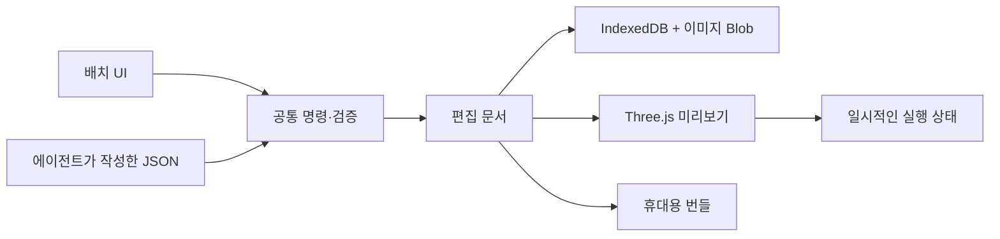

# Content Studio — 첫 구현

이 문서는 기능 변경과 함께 유지관리한다. 시각 계획의 정본은 [roadmap.json](./roadmap.json)이며, [시각 계획표](../../public/studio-plan.html)는 자동 생성 결과다.

## 목적과 첫 세트

게임·인터랙티브 웹·강의 콘텐츠에 사용할 제작 기반을 검증한다.

| 층 | 첫 구현 | 경계 |
| --- | --- | --- |
| 공통 | 엔진 독립 문서, 이미지 Blob, 검증된 명령, 저장·번들 교환 | 브라우저 초안 하나 |
| 도구 | 2D 도형·이미지 배치와 클릭 동작 | 타일맵·지형·타임라인은 후속 |
| 엔진 | Three.js + React Three Fiber | 정사영 렌더링, 별도 실행 상태 |

## 실행 — 전체 빌드 없이 미리보기

```sh
pnpm install
pnpm dev
```

- 편집기: `http://localhost:3000/studio`
- 시각 계획: `http://localhost:3000/studio-plan.html`
- 기존 앱: 작업공간 하단 빠른 작업 메뉴 → 콘텐츠 스튜디오
- 편집기 안의 변경은 즉시 렌더링한다. 코드 변경은 Next 개발 서버가 반영한다.
- 배포할 때 `pnpm build`로 정적 파일을 생성한다. Studio는 Next 서버 API를 사용하지 않는다.

## 확인 흐름

1. 샘플의 Switch를 선택하고 드래그하거나 위치·색·크기를 변경한다.
2. 미리보기를 누른 뒤 보라색 Switch를 눌러 Signal 표시를 전환한다.
3. 편집으로 돌아오면 원본 표시 상태가 유지된다.
4. PNG/JPEG/WebP 이미지를 추가하고 자동 저장 완료를 기다린다.
5. 새로고침하여 이미지와 배치를 확인한다.
6. 번들을 내보내고 다시 가져온다. 객체 삭제·가져오기도 실행 취소할 수 있다.
7. 명령 작업공간에서 JSON 명령을 적용하고 한 번에 실행 취소한다.

## 저장과 교환

- IndexedDB `codeg-content-studio-v1`: `drafts`는 현재 문서와 저장 버전, `blobs`는 SHA-256 ID별 이미지 원본이다.
- 문서 변경과 필요한 Blob은 한 트랜잭션으로 저장된다. 다른 탭이 먼저 저장하면 자동 저장을 중단하고 내보내기를 안내한다.
- 저장 실패 시 메모리의 편집 결과는 유지된다. 번들로 내보낸 뒤 새로고침한다.
- 실행 취소는 메모리에 최대 50단계를 보관한다. 영속 버전 이력이 아니다.
- `.studio.json` 번들은 문서와 Base64 이미지 원본을 담는다. 렌더링 중에는 Blob을 사용하며, Base64는 파일 교환에만 사용한다.
- 가져올 때 문서 스키마, 참조, 이미지 시그니처·크기·SHA-256을 검증한다. 임의 스크립트·URL·HTML을 실행하지 않는다.
- 저장소는 서버나 프로젝트 폴더와 연결되지 않는다. 에셋 삭제·미사용 Blob 회수는 후속 단계다.

## 에이전트와 공통 명령

이번 단계에는 실시간 MCP 연결이 없다. 에이전트는 내보낸 번들의 문서를 편집하거나 아래 명령 배치를 작성할 수 있다. 사용자가 번들을 가져오거나 명령 작업공간에 적용한다.

```json
[
  { "type": "node.update", "id": "signal", "patch": { "color": "#ffcc66" } },
  { "type": "node.update", "id": "switch", "patch": { "toggleTarget": "signal" } }
]
```

| 명령 | 내용 |
| --- | --- |
| `document.update` | `patch`: name, background |
| `node.add` | `node`: StudioNode 전체 필드 |
| `node.update` | `id`, `patch`: name, x, y, width, height, color, visible, toggleTarget |
| `node.remove` | `id`; 관련 클릭 참조도 제거 |
| `node.reorder` | `id`, `direction`: forward 또는 backward |

- 좌표는 좌측 상단 기준 픽셀이다. nodes 배열 뒤쪽이 앞 레이어다.
- 명령은 전체 배치가 검증된 경우에만 적용된다. 실패하면 원본을 유지한다.
- renderer 객체, 임의 JS 함수, 코드 문자열은 문서에 포함하지 않는다.
- `toggleTarget`은 대상의 표시 여부를 실행 상태에서만 반전한다.
- 이미지 원본을 바꾸면 새 해시와 메타데이터를 함께 만들어야 한다. 원본 이미지 가져오기를 사용한다.

## 구조



- `src/lib/studio/document.ts`: 스키마 검증·명령, 렌더러·브라우저 저장에 독립적.
- `src/lib/studio/storage.ts`: Blob 저장, 교환 파일, 이미지 검증.
- `src/components/studio/`: 배치 도구와 렌더러.
- `src/app/studio/page.tsx`: 정적 라우트.

## 검증과 계획 유지관리

```sh
pnpm studio:plan
pnpm studio:plan:check
pnpm exec vitest run src/lib/studio
pnpm lint src/app/studio src/components/studio src/lib/studio scripts/build-studio-plan.mjs
pnpm exec tsc --noEmit
pnpm studio:test  # 별도 터미널에서 pnpm dev 실행 필요
pnpm build
```

기능 변경 시 같은 변경 묶음에서 다음을 수행한다.

1. `roadmap.json`의 단계 상태·완료 기준·경계·검증 결과를 업데이트한다.
2. 이 README의 사용법·명령·제약이 구현과 맞는지 확인한다.
3. `pnpm studio:plan`으로 시각 계획을 생성한다.
4. `pnpm studio:plan:check`로 문서 동기화를 확인한다.

실제 검증 결과는 roadmap.json의 checks에 기록한다. 검증하지 않은 항목을 완료로 표시하지 않는다.

브라우저 검증은 설치된 Chrome을 사용한다. 다른 실행 환경에서는 `STUDIO_BROWSER`를 지정할 수 있으며, 서버 주소는 `STUDIO_URL`로 바꾼다.

Node 26에서 jsdom 테스트가 전역 localStorage 충돌로 실패하면 `NODE_OPTIONS=--no-experimental-webstorage pnpm test`를 사용한다. 제품 코드 변경 없이 테스트 런타임의 중복 Web Storage를 비활성화한다.

## 현재 검증 상태

2026-09-19 기준 전체 린트, TypeScript, 정적 빌드가 통과했다. Vitest 456개 파일 / 6,632개 테스트와 실제 Chrome 브라우저 시나리오 3개가 통과했다. 브라우저 시나리오는 렌더 픽셀, 클릭 동작, 드래그·명령·실행 취소, 이미지 번들과 새로고침 복원, 모바일 및 한국어·어두운 테마를 확인한다. 상세 기록은 시각 계획의 검증 기록을 참조한다.

## 다음 제작 흐름과 데스크톱

새 게임 → 템플릿을 독립 폴더로 복제 → 기존 AI 작업공간 연결 → 필요한 도구 호출 → 산출물을 게임에 적용 → 즉시 미리보기 순으로 확장한다. 이 흐름은 현재 계획 단계이며 브라우저 초안 편집과 구분한다.

데스크톱 앱 이름은 `codeg-gameeditor`이며 `pnpm tauri build --bundles app`으로 빌드한다. 로컬 개발용 빌드에서는 업스트림 자동 업데이트 대상과 서명 업데이트 산출물을 비활성화한다.

### 프로젝트 연결의 구현 기준

1. 템플릿 목록은 ID·버전·렌더러·시작 명령·파일 목록을 선언한다. 새 게임은 기존 폴더를 덮어쓰지 않고 복제한 뒤 작업공간으로 연다.
2. 프로젝트에는 원본 에셋, 엔진 독립 편집 문서, 생성 산출물을 분리한다. 에이전트도 같은 파일과 검증 명령을 사용한다.
3. 도구 목록은 입력/출력 스키마와 지원 문서 버전을 선언한다. UI 모듈은 필요할 때 로드하고, 에이전트 호출도 같은 명령 처리기로 연결한다.
4. 도구 결과는 검증 후 하나의 변경으로 적용한다. 실패 시 현재 문서를 유지하며 적용 이력에서 되돌릴 수 있어야 한다.
5. 파일 변경 감지로 미리보기를 갱신한다. 에셋 재가공과 배포 빌드는 구분하고, 원본 해시·도구 버전·옵션을 기준으로 필요한 산출물만 다시 만든다.

로컬 macOS 앱은 기존 Codeg와 별도의 식별자 `app.codeg.gameeditor`를 사용한다. 기존 `codeg://` 연결을 차지하지 않도록 OS 딥링크 등록도 비활성화한다.

네이티브 빌드 환경: Rust 1.88은 기존 코드의 `std::fs::File::try_lock` 때문에 실패했다. 이 환경은 `rustup update stable`로 Rust 1.98.1로 갱신했다. 프런트엔드 정적 파일을 이미 빌드한 경우 `pnpm tauri build --bundles app --config '{"build":{"beforeBuildCommand":"pnpm tauri:prepare-sidecars"}}'`로 웹 빌드를 반복하지 않고 패키징할 수 있다.

데스크톱 검증 결과: macOS arm64 릴리스 빌드 및 `open` 실행 성공, 실행 프로세스와 번들 이름·식별자를 확인했다. 산출물은 `src-tauri/target/release/bundle/macos/codeg-gameeditor.app`이다. 브라우저 검증 3개도 다시 통과했다. 네이티브 창의 시각 검수는 자동화 도구의 심볼릭 링크 경로 제약으로 확인하지 못했다. 앱에 포함된 계획표는 빌드 시점 스냅샷이며 최신 상태는 저장소의 생성 문서를 기준으로 한다.
