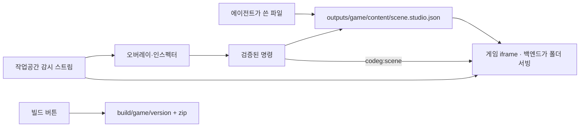

# Content Studio — 첫 구현

> **기반은 [codeg](https://github.com/xintaofei/codeg)(xintaofei, Apache-2.0)다. 고맙다는 말을 먼저 적어 둔다.**
> 어려운 쪽은 이미 풀려 있었다 — 여러 코딩 에이전트를 한 작업공간에 모으고, 세션을 묶어 두고,
> 에이전트가 다른 에이전트에게 일을 넘기는 부분. 이 fork 가 얹은 것은 그 위의 콘텐츠 층(이 문서)이고
> 아래쪽은 거의 그대로 쓴다. 이름을 Tinysolver Studio 로 바꾼 것은 만드는 것이 코드가 아니라
> 콘텐츠라서다 — codeg 를 지우려는 뜻이 아니다(→ 왜 페이지 `tinysolver-studio-name`).


이 문서는 기능 변경과 함께 유지관리한다. 시각 계획의 정본은 [roadmap.json](./roadmap.json)이며, [시각 계획표](../../public/studio-plan.html)는 자동 생성 결과다.

## 목적과 첫 세트

게임·인터랙티브 웹·강의 콘텐츠에 사용할 제작 기반을 검증한다.

| 층 | 현재 구현 | 경계 |
| --- | --- | --- |
| 문서 | 엔진과 편집기가 공유하는 장면 파일 `outputs/game/content/<scene>.studio.json`, 검증된 명령, etag 저장 | 프로젝트 폴더 안에서만 |
| 도구 | iframe 위 오버레이로 선택·드래그, 인스펙터(transform·그리기 속성·행동·클릭 액션), 액션 단계 편집, 플레이 중 게임 변수와 다시 시작, 장면 추가·전환 | 이미지 업로드·타일맵·타임라인은 후속 |
| 엔진 | Studio가 제공하는 관리형 런타임 `codeg-engine`(three-web 0.5.0). 0.5.0 부터 `model` 노드(GLB 를 노드마다 렌더 타깃에 그려 평면에 붙인다 — 배치 · z · 표시는 2D 노드와 같고 3D 방향은 `props.yaw`·`pitch`, 행동 `turntable`). 프로젝트에는 장면과 스크립트만 있고, 미리보기 서버가 `__codeg/`로 서빙하며 빌드가 같은 경로에 넣는다 | 편집/플레이 모드, 스크립트, 트윈, 입력, GLB 모델 노드. 3D 카메라 · 조명 장면 · 물리 · 타일맵은 없다 |
| 플랫폼 층 | 게임은 저장·플레이어·순위·공유·광고를 `codeg-platform` 하나로 부른다. importmap이 `__codeg/platform/current.js`를 가리키고, 그 파일이 대상의 어댑터다 — 미리보기는 `studio`(가짜판), 빌드는 `web`. 같은 게임 코드가 대상만 바꿔 돈다 | 대상은 지금 `studio`·`web`. afterplay·Tauri·Capacitor는 다음 단계 |
| 출시 | 빌드 버튼 → `build/game/<version>/` + zip(엔진·플랫폼 어댑터 포함, CDN 없음, 문서 `*.md` 제외). "어디서든 돌려면" 검사 결과가 빌드의 `warnings`로 남는다. 빌드마다 **출시** → Studio의 `/play/<slug>/` 링크, **배포** → 매니페스트의 `publish.command` | 외부 호스트 계정·자격 증명은 호출되는 CLI의 것 |

## 실행 — 전체 빌드 없이 미리보기

```sh
pnpm install
pnpm dev
```

- 편집기: 작업공간에서 프로젝트 폴더를 열고 빠른 작업 → 콘텐츠 스튜디오. `?path` 없는 `/studio`는 안내만 보여 준다(브라우저 초안 모드는 없어졌다).
- 시각 계획: `http://localhost:3100/studio-plan.html`
- 어떻게 만들었나(인터랙티브): `http://localhost:3100/how-built.html` — 편집기 헤더와 빠른 작업 메뉴의 버튼. 원본은 `docs/studio/how-built.json`.
- 기존 앱: 작업공간 하단 빠른 작업 메뉴 → 콘텐츠 스튜디오, 또는 창작 스튜디오 탭 → Studio 열기. 활성 폴더가 있으면 대화 옆 파일 창에 파인으로 열리고 그 폴더의 `outputs/game/content/`에 저장한다. 폴더가 없으면 `/studio` 단독 페이지.
- 편집기 안의 변경은 즉시 렌더링한다. 코드 변경은 Next 개발 서버가 반영한다.
- 배포할 때 `pnpm build`로 정적 파일을 생성한다. Studio는 Next 서버 API를 사용하지 않는다.

## 개발 루프 — 빌드 없이 변경을 바로 본다

| 목적 | 명령 | 반영 속도 |
| --- | --- | --- |
| 프런트엔드만 (시작 화면 UI, /studio 안내 화면) | `pnpm dev` → `http://localhost:3100` | 저장 즉시 HMR |
| 프런트엔드 + 실제 백엔드 (장면 저장, 게임 미리보기, 빌드) | 터미널 1: `pnpm server:dev` (또는 `CODEG_TOKEN=dev ./src-tauri/target/debug/codeg-server`) · 터미널 2: `pnpm dev:web` → `http://localhost:3100/login`에서 토큰 입력 | 프런트 즉시, Rust는 `cargo run` 재실행(증분 컴파일) |
| 데스크톱 창 그대로 | `pnpm tauri dev` | 프런트 즉시(HMR), Rust 변경 시 자동 재빌드 |

`pnpm dev:web`은 `NEXT_PUBLIC_CODEG_API_URL=http://127.0.0.1:3081`로 웹 트랜스포트를 별도 서버에 붙인다(서버 CORS 허용, WebSocket은 origin 제한 없음). 배포 빌드에는 이 변수를 넣지 않는다. `pnpm build` + 바이너리 실행은 배포 전 최종 확인용이다.

## 확인 흐름

1. 창작 스튜디오 탭 → 새 콘텐츠 프로젝트(web-three) → 작업공간이 열리면 빠른 작업 → 콘텐츠 스튜디오.
2. 스캐폴드된 `main` 장면이 게임 iframe에 그려진다. `hero`를 드래그하면 즉시 움직이고 0.5초 뒤 파일에 저장된다.
3. 편집 중에는 주인공이 가만히 있다. 미리보기를 누르면 `float` 스크립트가 돌아 둥실거리고, 클릭하면 `logic.actions.act_hero`가 힌트를 토글하고 `shake` 연산(프로젝트의 `src/main.js`)이 흔든다. 편집으로 돌아오면 게임 상태가 문서 기준으로 초기화된다.
4. 대화창에서 에이전트에게 장면을 고치게 한다. 저장되는 순간 편집기가 다시 읽고 iframe이 갱신된다. 편집 중이었다면 배너가 뜬다.
5. 빌드를 누르면 `build/game/v1-…/`와 zip이 생기고 사이드바에 버전이 보인다. 그 아래 **출시**를 누르면 `/play/<프로젝트>/` 링크가 생기고, 로그인하지 않은 브라우저에서도 게임이 열린다. **내리기**로 링크를 닫는다.
6. 명령 작업공간에서 JSON 명령을 적용하고 한 번에 실행 취소한다.

## 저장

- 장면은 프로젝트 폴더의 `outputs/game/content/<scene>.studio.json` 하나뿐이다. 브라우저 저장소(IndexedDB)와 번들 내보내기는 없어졌다. git이 이력이다.
- 저장은 백엔드 etag를 싣는다. 디스크가 바뀌었으면 거부되고 메모리의 편집은 유지된다. 감시 스트림이 그 변경을 알리면 편집 중이 아닐 때는 자동으로 다시 읽는다.
- 실행 취소는 메모리에 최대 50단계다.
- 편집기는 자기가 아는 필드만 검증하고 나머지는 보존한다. 임의 스크립트·함수는 문서에 들어갈 수 없다.

## 에이전트와 공통 명령

에이전트는 장면 파일을 직접 편집하면 된다. 스키마는 생성된 `outputs/game/content/README.md`와 [project-layout.md](./project-layout.md)에 있다. 편집기 안의 명령 작업공간은 같은 검증기를 거치는 JSON 배치다.

```json
[
  { "type": "node.update", "id": "title", "transform": { "y": 260 }, "props": { "color": "#ffcc66" } },
  { "type": "node.add", "node": { "id": "sign", "parent": "root", "type": "rect",
      "transform": { "x": 100, "y": 100, "w": 300, "h": 200, "anchor": "top-left", "z": 5 },
      "props": { "color": "#6d7a8c" } } }
]
```

| 명령 | 내용 |
| --- | --- |
| `scene.update` | `name` |
| `node.add` | `node`: SceneNode 전체 |
| `node.update` | `id`, `transform`(부분), `props`(얕은 병합) |
| `node.remove` | `id`; 자식 노드도 함께 |
| `node.reorder` | `id`, `direction`: forward(맨 앞 z) 또는 backward(맨 뒤 z) |
| `action.set` | `name`, `steps`: `[{ op, …, if? }]` → `logic.actions[name]` |
| `action.remove` | `name` |
| `asset.set` | `asset`: `{ id, file, width, height }` → `document.assets`(같은 id 면 바꾼다) |
| `asset.remove` | `id`; 그 에셋을 쓰는 노드가 있으면 거부 |

- 명령은 전체 배치가 검증된 경우에만 적용된다. 실패하면 원본을 유지한다.
- 행동은 명령이 따로 없다. `node.update`의 `props.script`에 이름, `{ name, …설정 }`, 또는 그 배열을 쓴다(`null`이면 제거). 인스펙터의 **행동** 섹션이 이 값을 편집하며, 선택 목록과 내장 스크립트의 기본 설정은 엔진이 `codeg:ready`로 알려 준 것이다(`src/lib/studio/behaviors.ts`).
- 에이전트는 같은 명령을 MCP 도구로 쓴다. 콘텐츠 프로젝트 폴더에서 연 세션에는 codeg-mcp 동반 프로세스가 `studio_list_scenes`·`studio_read_scene`·`studio_apply_scene_commands`·`studio_build`·`studio_publish`와 재료 도구 `studio_list_assets`·`studio_import_asset`·`studio_generate_asset`·`studio_update_asset`·`studio_render`를 노출한다. 검증기는 `src-tauri/src/studio_scene.rs`(이 문서의 `document.ts`와 같은 규칙)이고, 파일에 쓰면 편집기와 미리보기가 감시 스트림으로 알아챈다.
- 편집기 → 에이전트: 헤더의 **대화로 보내기**가 장면 파일 배지와 함께 현재 장면·선택한 노드·미리보기 런타임 오류를 옆 대화의 입력창에 넣는다. 전송은 사용자가 한다. 게임 보기의 오류 띠에도 같은 버튼이 있다.
- 미리보기 서버는 서빙하는 HTML에 오류 보고 스크립트를 주입한다(`codeg:error` postMessage). 엔진을 에이전트가 새로 썼더라도 예외·거부된 프로미스·`console.error`·리소스 로드 실패가 편집기에 뜬다. 빌드 산출물에는 들어가지 않는다.
- 같은 자리에 미리보기 표식 `window.__codegPreview`를 심는다. 엔진은 이 표식이 있는 iframe에서만 편집기 프로토콜(`codeg:*`)을 말한다 — afterplay처럼 게임을 iframe에 띄우는 다른 곳에 편집기 메시지를 보내지 않는다. 플랫폼 층 이전에 만든 프로젝트의 importmap에는 `codeg-platform` 항목을 미리보기·빌드가 채워 준다(프로젝트 파일은 고치지 않는다).

## 첫 화면 — 만드는 흐름 (first-screen · fs-layout A · fs-flow)

작업공간 가운데가 채팅 대신 **만드는 흐름**이다. 채팅(업스트림 대화 패널 그대로)은 오른쪽 서랍으로 옮겼다 — 열기 · 넓히기(전체) · 닫기, 사이드바에서 대화를 고르면 저절로 열린다. 업스트림 파일은 `src/app/workspace/page.tsx` 한 줄(진입점)만 바꿨다 — 나머지는 `src/components/studio/home/` · `src/lib/studio/flow.ts`.

- **시작** — "무엇을 만들까요?" 한 칸 + 결과 칩(영상 · 3D 모델 · 그림 · 게임 장면) + '캐릭터예요' + 생성기 주소(마지막에 쓴 것을 기억) + 최근 콘텐츠 프로젝트(재료 썸네일 · 흐름 요약). **만들기**는 `~/TinysolverStudio/<프롬프트에서 딴 이름>`에 콘텐츠 프로젝트(web-three · game + video)를 만들고 생성기를 연결하고 흐름을 쓴 뒤 그 폴더를 작업공간에 연다(서랍의 에이전트도 그 폴더에서 일한다).
- **단계 카드** — 칩마다 단계가 정해진다(`planSteps`): 영상 = 그림 → 3D → 장면 · 카메라 → 렌더 → 영상, 캐릭터면 3D 앞에 T포즈 · 뒤에 뼈 넣기(렌더는 걷기). 3D 모델 = 그림 → (T포즈) → 3D → (뼈). 그림 = 그림. 게임 장면 = 그림 → (T포즈) → 3D. 카드는 앞에서부터 **저절로 차례로** 돈다(실패하면 멈추고 '이어서 하기').
- 카드마다 결과 미리보기(그림 · GLB 뷰어 · 영상) · **다시 하기**(그 뒤 카드는 비운다) · **편집 도구**(대화 옆 Studio 편집기 — 재료 서랍). 장면 · 카메라 · 렌더 카드에 좌우 · 높이 · 거리, 영상 카드에 동작 프롬프트.
- 카드 = 서랍 단추 = MCP 도구: 각 단계는 `studio_run`의 `generate_asset` · `render_asset` 하나다(`stepOp`). 흐름 기록은 프로젝트의 `studio-flow.json`(`read_flow` · `write_flow`) — 다시 열면 카드가 돌아오고 에이전트도 읽는다.
- 실측(10-09): 'a small blue ceramic teacup with a gold rim' · 영상 → 다섯 칸이 6분 40초에 다 찼다(3D 대기열 ≈2분 · 영상 ≈3분 20초 · 렌더는 linux-2 Blender).
- **단계마다 고르기**(step-options) — 첫 화면 입력 옆에 그림 모델 빠른 고르기(기본은 생성기 GPU `qwen-image-21-rgba`), 그림 · 3D · 영상 카드의 '설정'(⚙)에서 그림 공급자 · 모델(무료 · 구독 · 종량과 예상 시간 · 값) · 3D 용도 프리셋 · 면 수 · 텍스처 · 텍스처 압축 · 영상 워크플로 · 길이를 고른다. 고른 값은 `studio-flow.json`의 `options`에 남고 '다시 하기'가 그 값으로 돈다. 카드 아래 한 줄은 재료의 출처(`source`)에서 읽은 **실제로 쓴** 모델 · 값과 이번에 걸린 시간.
  - 목록은 `studio_run` `generator_options`(MCP `studio_generator_options`) 하나 — 생성기의 `GET /api/images/workflows` · `/api/videos/workflows`(t2i · LoRA 없음 · 파이프라인 단계 제외 / i2v 한 장 입력)에 클라우드 그림(`studio_assets::CLOUD_IMAGES`: codex gpt-image-2 = 생성기 주인의 ChatGPT 구독 · openrouter 나노바나나 2.1 · Pro = 종량)과 3D 프리셋을 붙인다. 검증은 `generator_call` 하나 — 카드와 `studio_generate_asset`(`provider` · `model` · `compress_textures`)이 같은 길이다.
  - 클라우드 그림은 불투명(3D 단계가 배경을 스스로 자른다). Studio 는 `X-Mygenai-Caller` 를 보내지 않는다(구독 경로는 제품 이름이면 403).

## 재료 — 생성 ↔ 재료 (asset-workbench ①)

AI 생성물을 프로젝트의 재료로 받고, 재료를 다시 생성 입력으로 넣는다. 편집기 사이드바의 **재료** 패널과 에이전트의 MCP 도구가 **같은 명령**(`studio_tools::StudioOp` — 편집기는 `studio_run` 하나로 부른다)을 쓴다.

| 명령 (MCP 도구) | 편집기 | 내용 |
| --- | --- | --- |
| `list_assets` (`studio_list_assets`) | 패널 목록 · 감시 스트림으로 자동 갱신 | `assets/manifest.json` 항목 + 파일 존재 여부 + 연결된 생성기 |
| `import_asset` (`studio_import_asset`) | — (에이전트가 자기 genai 도구로 만든 것을 받을 때) | URL(http(s) · base64 data:)을 `assets/generated/{images,models}/`로 받아 등록. 출처 `source`(workflow · prompt · seed · from · url)를 남긴다. 생성기 `/outputs/` 의 파일이면 받은 뒤 생성기 사본을 지운다(`DELETE /api/outputs?path=`) |
| `generate_asset` (`studio_generate_asset`) | **그리기**(프롬프트) · 재료의 **3D 로** | 생성기를 불러(`/api/images/generate` · `/api/3d/generate`) 결과를 `import_asset`으로 받는다. `from` 재료를 `source_image`로 넣는다. 3D 기본값은 버튼 기준 1만 면 · 텍스처 2048 |
| `connect_generator` (편집기 전용) | 생성기 주소 넣고 **연결** | `codeg-project.json`의 `generate.url`을 쓴다 |

- 생성기 주소는 프로젝트 매니페스트 `generate.url`에 둔다(decide `aw-gen-connect` 권장안 A — `publish.command`와 같은 자리). 주소만 있고 자격 증명은 없다. 비어 있으면 생성 명령이 그 사실과 고치는 법을 돌려준다.
- 생성기는 **부르기만** 한다 — 무엇에 쓸지는 넘기지 않는다(genai 에 사용처를 넣지 않는다). 보관 책임은 프로젝트이고, 생성기 쪽 사본은 받은 뒤 지운다.
- 생성기가 꺼져 있으면(linux-2 on-demand) 명령이 `ok: false`와 읽을 수 있는 메모를 돌려준다. 3D 는 대기열에 따라 1~10분.
- 등록부는 JSON 값으로 고쳐서 모르는 필드(game-asset-contract 의 `role`·`sheet` 등)를 보존하고, 키 순서(`id`·`file`·`kind`…)를 지켜 쓴다.
### 기준 프리셋 · 검사 (asset-workbench ③)

'어디에 쓸 것'(재료의 `use`)을 고르면 생성 값이 정해지고, 재료가 그 기준을 넘으면 서랍과 MCP 결과에 경고가 붙는다. 표의 정본은 `src-tauri/src/studio_presets.rs` 하나이고, 편집기는 `list_assets`의 `presets`로 받는다.

| id | 면 수(권장) | 상한 | 텍스처 | 용량 | 생성 값(target_faces · texture_size) |
| --- | --- | --- | --- | --- | --- |
| `mobile-prop` 모바일 소품 | 300~1,500 | — | ≤2048 | ≤5MB | 1,000 · 1024 (genai 최소 1,000) |
| `mobile-character` 모바일 캐릭터 | 3k~10k | — | ≤2048 | ≤5MB | 8,000 · 2048 |
| `roblox-meshpart` Roblox MeshPart | 3k~10k | 21k | ≤2048 | — | 8,000 · 1024 |
| `web-ar` 웹 · AR(Scene Viewer) | 30k~50k | — | ≤2048 | ≤5MB | 40,000 · 2048 |
| `pc-hero` PC · 콘솔 주인공 | 20k~100k | — | ≤4096 | — | 80,000 · 4096 |
| `print-3d` 3D 프린트 | 100k+ | — | — | — | 300,000 · 1024 (닫힌 메시 — 아직 검사 안 함) |

- 검사 결과는 항목마다 `check: [{ level: over|warn|info, code, value, limit, message }]`. 기준과 무관하게, 투명 워크플로(`*-rgba`)로 만든 그림이 불투명하면 `not_transparent` 경고(그림의 `opaque`는 받을 때 픽셀을 읽어 둔다).
- 명령: `generate_asset`·`import_asset`의 `use`(3D 는 비운 `target_faces`·`texture_size`를 프리셋 값으로 채우고 재료에 `use`를 남긴다), `update_asset { id, use }`(MCP `studio_update_asset`, 편집기는 미리보기 창의 '쓸 곳').
- 편집기: 생성 상자의 '쓸 곳'이 다음 그리기 · 3D 로에 적용된다. 정하지 않으면 3D 는 1만 면 · 2048.

### 재료 서랍 (asset-workbench ②)

- **올리기** — 패널 머리의 올리기 단추로 이미지(png · jpg · webp · gif)와 GLB 를 여러 개 고른다. `import_asset`에 base64 data: URL 로 실려 `assets/uploads/`에 들어간다(웹 서버 경로 `/api/studio_run` 은 300MB 까지).
- **손으로 둔 파일** — `assets/` 아래 있지만 등록부에 없는 이미지 · 모델은 `list_assets`의 `unregistered`로 나오고 **등록** 단추(= `import_asset`의 `file`)로 제자리 등록한다. 에이전트도 같은 인자를 쓴다.
- **숫자** — 이미지는 `width`·`height`, 모델은 GLB 를 읽어 `triangles`·`vertices`·`textures`([w, h])·`texture_max`. 받을 때 등록부에 쓰고, 숫자가 없는 옛 항목은 목록을 낼 때 파일에서 읽는다(등록부는 고치지 않는다).
- **미리보기** — 썸네일을 누르면 이미지는 크게, GLB 는 미리보기 서버의 `__codeg/viewer/model.html?src=…`(벤더링한 three 0.170 GLTFLoader · OrbitControls, 빌드에는 안 들어간다)로 돌려 본다. 출처(workflow · prompt · seed · from)도 함께.
- **장면에 놓기** — 이미지 재료를 열린 장면에 선언(`asset.set`)하고 sprite 노드를 하나 더한다(컨테이너 40% 안으로 맞춤, 한 번의 실행 취소). 장면 명령 `asset.set`·`asset.remove`는 두 검증기(`document.ts` · `studio_scene.rs`)에 같이 있다.
- 구현: `src-tauri/src/studio_assets.rs`(목록 · 받기 · 생성 · 연결 · GLB 숫자), `src/components/studio/studio-materials.tsx`(서랍), `src-tauri/engines/viewer/model.html`.

### 렌더 — 사용자 PC 의 Blender (blender-video · bv-blender-run)

모델 재료를 Blender 로 헤드리스 렌더해 영상 · 키프레임 그림을 재료로 받는다. 서랍의 모델 **렌더** 단추와 MCP `studio_render`가 같은 명령 `render_asset`이다(decide `bv-where` A — 사용자 PC 렌더 · 생성기에 렌더를 넣지 않는다).

- **Blender 찾기** — `codeg-project.json`의 `render.blender` → 환경 변수 `BLENDER` → `PATH`의 `blender` → OS 표준 위치(macOS `/Applications/Blender.app/Contents/MacOS/Blender` · `~/Applications/…`, Linux `/snap/bin/blender` · `/usr/bin` · `/usr/local/bin` · `/opt/blender` · flatpak, Windows `Program Files\Blender Foundation\Blender *\blender.exe` 최신 먼저). 없으면 설치 · 경로 지정 방법을 메모로 돌려준다.
- **스크립트** — `src-tauri/src/studio_render.py` 를 바이너리에 넣어(`include_str!`) 임시 폴더에 풀고 `blender -b --factory-startup -P studio_render.py -- job.json` 으로 부른다. 장면은 10-07 실측 레시피(handoff `turntable.py`): 높이 2 · 바닥 중앙 · 바닥판 · area light 셋 · 밝은 world · pivot 에 붙은 카메라. 엔진 EEVEE. 영상은 Blender 내장 FFmpeg(H.264 mp4)이라 따로 ffmpeg 가 필요 없다. 30분 넘으면 멈춘다.
- **입력** — `{ from, mode: turntable|still, frames(기본 72 = 3초), width · height(기본 720, 짝수로), cam_dist(기본 6.2 · 모델 높이 2 기준), yaw, pitch(기본 8°), keyframes(기본 [1]), id }`.
- **결과** — `assets/generated/renders/<id>.mp4`(`kind: video`) + 키프레임마다 `<id>-fNNN.png`(`kind: image`), 출처 `source: { kind: render, from, workflow: blender-<mode>, params, blender, engine, seconds, frame }`. 키프레임 그림은 다음 단계(그림 편집 · i2v)의 입력이 된다.
- 재료 종류에 `video`(mp4 · webm · mov)가 생겼다 — 서랍은 첫 프레임을 썸네일로, 미리보기 창은 재생기로 보인다.
- **걷기** — `mode: walk`는 리깅된 모델(재료에 `bones`)을 제자리에서 1초 주기로 걷게 한다(48프레임 · 3/4 시점 yaw -30°). 팔 · 다리 사슬은 뼈 이름이 아니라 모양으로 찾는다(가장 바깥 위 끝 = 손, 가장 아래 끝 = 발 — model-pick `bench/rig/rigeval.py`). 뼈 없는 모델은 '먼저 뼈 넣기' 메모.

### 단계 — T포즈 · 뼈 넣기 · 영상 (blender-video · bv-video-gen · 리깅 칸)

`generate_asset`의 `kind`가 여섯이 됐다. 서랍 단추와 MCP `studio_generate_asset`이 같은 명령이다.

| kind | `from` | 생성기 | 서랍 단추 | 기본값 |
| --- | --- | --- | --- | --- |
| `image` | (그림) | `/api/images/generate` | 그리기 | qwen-image-21-rgba(프롬프트를 RGBA 레시피로 감싼다) |
| `edit` | 그림 | `/api/images/generate` + `source_image` | — (MCP) | qwen-image-21-edit · 배경 지우기 |
| `tpose` | 캐릭터 그림 | 같음 | **T포즈로** | 고정 프롬프트(같은 옷 · 팔 수평 · 정면) · 입력을 밝은 회색 정사각에 놓는다(model-pick `tpose.py`) |
| `3d` | 그림 | `/api/3d/generate` | 3D 로 | trellis2 · 쓸 곳 프리셋 |
| `rig` | 모델 | `/api/3d/rig`(SkinTokens) | **뼈 넣기** | — |
| `video` | 그림(렌더 키프레임) | `/api/videos/generate` | **영상으로**(그리기 칸의 글 = 동작 · 카메라 · `Audio: …`) | minimax-h3-i2v · 768² · 5초 (turbo 는 10-09 genai 500 — 이슈 1009-8) |

- 캐릭터 흐름: 그림 → **T포즈로** → 3D → **뼈 넣기** → 렌더 **걷기** → 키프레임 → **영상으로**. T포즈를 3D 앞에 두는 것은 model-pick 판 ②의 결론(자연 포즈 1/6 · T포즈 5/6 리깅 성공)이다.
- 모델의 `bones`(가장 큰 skin 의 joint 수) · `animations`는 GLB 를 읽어 재료에 남긴다. 서랍은 뼈가 있으면 **걷기**, 없으면 **뼈 넣기**를 보인다.
- 영상 재료의 출처에는 생성기가 돌려준 실제 `width`·`height`·`frames`·`fps`와 `audio`가 남는다.

## 3D 촬영장 (film-set · fs3-set · fs3-truth A)

쇼츠 · 뮤비 · 영화 · 웹툰을 찍는 3D 무대. 정본은 `outputs/film/sets/<id>.set.json` 하나다 — 세트(바닥 · 배경 · 조명) · 소품(GLB 재료) · 배우(리깅된 GLB + 동작 + 키) · 카메라 여러 대(렌즈 · 경로 키). 스키마는 처음 만들 때 같은 폴더에 쓰이는 `README.md`(원본 `src-tauri/src/studio_set_readme.md`).

- **공간 · 시간** — 미터, Y 위, 오른손(glTF 와 같다) · 정면 +Z · 회전은 XYZ 오일러 도. 모델은 발밑 가운데가 `position`, `height` 로 키를 맞춘다. 키 사이는 `ease`(smooth = 구간마다 u²(3−2u), linear). 이 보간 식은 `studio_set.rs::sample` · `set.html` · `studio_render.py` 세 곳에 같은 식으로 있다 — 미리보기와 렌더의 카메라가 프레임마다 같아야 한다.
- **규칙은 Rust 한 곳** — `studio_set.rs`(검증 · 명령 `set.update` · `add` · `update` · `remove` · `key.set` · `key.remove` · 원자적 · 모르는 필드 보존 · `issues`). TypeScript 쌍둥이는 없다: 3D 화면은 끌기가 끝나면 명령을 보내고 돌아온 문서를 그린다.
- **명령 = MCP 도구** — `studio_run` 의 `list_sets` · `read_set` · `create_set` · `apply_set_commands` · `render_set` 이 MCP `studio_list_sets` · `studio_read_set` · `studio_create_set` · `studio_apply_set_commands` · `studio_render_set` 이다.
- **3D 화면** — Studio 패널의 **촬영장** 탭(또는 `/studio?path=<프로젝트>&view=set`). 미리보기 서버의 `__codeg/viewer/set.html`(three.js · OrbitControls · TransformControls, 빌드에는 안 들어간다)을 iframe 으로 띄우고 postMessage 로 문서를 넘긴다(`codeg-set:load` · `time` · `select` · `view` · `mode` ↔ `ready` · `select` · `commands`). 끌기(W 옮기기 · E 돌리기)는 자유 시점에서, **카메라로 보기**는 결과 비율(기본 720×1280)로 레터박스. 키가 있는 배우 · 카메라는 재생 위치의 키를 고친다(없으면 그 시각에 새 키). 오른쪽은 목록 · 값 · 키 · `issues` · 마지막 렌더. 파일은 2초마다 다시 읽어 에이전트의 수정을 보인다.
- **렌더** — `render_set { set, camera, from?, to?, stills?(초), width?, height?, id? }` 가 `studio_render.py` 의 `mode: set` 으로 문서를 Blender 장면으로 만든다(조명 · 바닥 · 소품/배우 GLB 를 높이에 맞춰 놓기 · 걷기 배우는 제자리 걸음 + 키 이동 · 카메라를 프레임마다 키에서 계산). AgX 톤. 결과는 `assets/generated/renders/<set>-<camera>.mp4` + `-fNNN.png`, 출처 `source.from: set:<id>` · `workflow: blender-set` · 스틸마다 `t`.
- 미리보기 조명은 근사(area → 점광원)이고 배우는 걷지 않는다 — 렌더가 정본이다.

## 구조


```mermaid
flowchart LR
    Agent[에이전트가 쓴 파일] --> File[outputs/game/content/scene.studio.json]
    UI[오버레이·인스펙터] --> Commands[검증된 명령] --> File
    File --> Engine[게임 iframe · 백엔드가 폴더 서빙]
    Commands -- codeg:scene --> Engine
    Watch[작업공간 감시 스트림] --> UI
    Watch --> Engine
    Build[빌드 버튼] --> Out[build/game/version + zip]
```

- `src/lib/studio/document.ts`: 장면 스키마 검증·명령·좌표 계산, 프로토타입 파일 변환.
- `src/lib/studio/project-storage.ts`: 장면 목록·읽기·저장·etag.
- `src/components/studio/studio-stage.tsx`: iframe + 드래그 오버레이 + 엔진 핸드셰이크.
- `src/components/studio/studio-workspace.tsx`: 편집기 화면, 감시 구독, 자동 저장, 빌드, 출시.
- `src/components/studio/studio-engine-panels.tsx`: 행동·그리기 속성·액션 편집·게임 변수 패널.
- `src-tauri/src/content_preview.rs`: 프로젝트 폴더 HTTP 서빙(공개 라우트 + 데스크톱 루프백), HTML에 오류 보고 스크립트 주입.
- `src-tauri/src/content_publish.rs`: 출시한 빌드의 등록부와 공개 라우트 `/play/<slug>/`.
- `src-tauri/src/studio_scene.rs`, `studio_tools.rs`: 장면 검증·명령의 Rust 쌍둥이와 `studio_*` MCP 도구 구현. `acp/delegation/`의 companion·listener·transport가 연결한다.
- `src/lib/studio/agent-context.ts`, `src/components/studio/use-chat-bridge.ts`: 대화로 보내는 컨텍스트와 대화 입력창 연결.
- `src-tauri/src/commands/content_project.rs`: 스캐폴드, 매니페스트, 장면 목록, 빌드 패키징. `content_project_game_main.js`·`content_project_game_scripts.js`가 스캐폴드되는 게임 코드.
- `src-tauri/engines/three-web/runtime.js`·`ENGINE.md`, `engines/vendor/`: 관리형 런타임과 벤더링된 Three.js. `src-tauri/src/content_engine.rs`가 내장해 미리보기와 빌드에 제공한다.
- `src-tauri/engines/platform/`: 플랫폼 층 — `core.js`(표면·검사·없는 능력의 기본 동작)와 대상별 어댑터(`studio.js`·`web.js`). 표면은 afterplay SDK v2의 부분집합이다.
- `src-tauri/src/content_compat.rs`: 빌드 폴더를 훑어 "어디서든 돌려면" 규칙(바깥 네트워크·저장소 직접·`alert`/`window.open`·Service Worker·40MB)을 어긴 곳을 찾는다.
- `src/components/studio/game-preview.tsx`, `studio-pane.tsx`: 작업공간 파일 창의 게임 보기/장면 편집 전환.

## 검증과 계획 유지관리

```sh
pnpm studio:plan
pnpm studio:plan:check
pnpm exec vitest run src/lib/studio src/i18n
pnpm lint src/app/studio src/components/studio src/lib/studio scripts/build-studio-plan.mjs
(cd src-tauri && cargo test --features test-utils content_)
pnpm exec tsc --noEmit
pnpm studio:test  # 별도 터미널에서 pnpm dev 실행 필요 (안내 화면만; 실제 루프는 codeg-server + 프로젝트로 확인)
pnpm build
```

기능 변경 시 같은 변경 묶음에서 다음을 수행한다.

1. `roadmap.json`의 단계 상태·완료 기준·경계·검증 결과를 업데이트한다.
2. 이 README의 사용법·명령·제약이 구현과 맞는지 확인한다.
3. `pnpm studio:plan`으로 시각 계획을 생성한다.
4. `pnpm studio:plan:check`로 문서 동기화를 확인한다.

실제 검증 결과는 roadmap.json의 checks에 기록한다. 검증하지 않은 항목을 완료로 표시하지 않는다.

브라우저 검증은 설치된 Chrome을 사용한다. 다른 실행 환경에서는 `STUDIO_BROWSER`를 지정할 수 있으며, 서버 주소는 `STUDIO_URL`로 바꾼다.

Node 26에서 jsdom 테스트가 전역 localStorage 충돌로 실패하면 `NODE_OPTIONS=--no-experimental-webstorage pnpm test`를 사용한다. 제품 코드 변경 없이 테스트 런타임의 중복 Web Storage를 비활성화한다.

## 릴리스와 설치 — 만드는 곳과 쓰는 곳이 다르다

작업 머신은 linux-1이고, 앱을 쓰는 곳은 맥이다. 리눅스에서는 macOS 바이너리를 만들 수 없다(Tauri 번들링과 앱이 링크하는 Apple 프레임워크가 macOS 호스트를 요구한다). 그래서 **릴리스는 linux-1에서 끊고, 빌드는 GitHub 러너가 하고, 맥은 결과물만 받는다.**

| 단계 | 어디서 | 무엇을 |
| --- | --- | --- |
| 릴리스 끊기 | linux-1 | `scripts/studio-release.sh` — main이 깨끗하고 push된 상태인지 확인하고 `studio-v<앱 버전>-<날짜>.<순번>` 태그 하나만 push (`--check`는 보기만) |
| 빌드 | GitHub Actions | `.github/workflows/studio-release.yml` — macOS arm64 데스크톱 앱, 서버 tarball(linux-x64 · darwin-arm64), sha256. 전부 성공해야 릴리스가 공개된다 |
| 설치·업데이트 | 맥 | `curl -fsSL https://github.com/tiny-solver/tinysolver-studio/releases/latest/download/studio-install-macos.sh \| bash` — 최신 릴리스를 받아 체크섬·서명 확인 후 `/Applications/Tinysolver Studio.app` 교체 (`--check`는 비교만) |

- 업스트림의 `release.yml`(`v*.*.*` 태그, Apple Developer ID 필요)은 병합 충돌을 피하려고 그대로 뒀다. 이 저장소에는 `v*` 태그를 push하지 않으므로 돌지 않는다. **`git push --tags`는 쓰지 않는다** — upstream에서 받아 온 `v*` 태그가 같이 올라가 그 워크플로를 깨운다.
- 앱은 Developer ID 없이 ad-hoc 서명이다. curl로 받으면 격리 플래그가 붙지 않아 Gatekeeper는 조용하지만, macOS가 빌드마다 다른 앱으로 보기 때문에 업데이트 뒤 폴더·로컬 네트워크 권한을 다시 물을 수 있다.
- 앱 버전(`tauri.conf.json`)은 업스트림을 따라간다. 어느 빌드인지는 태그로 구분하고, 맥에는 `~/.tinysolver-studio/installed-release`에 설치된 태그가 남는다.

## 현재 검증 상태

2026-09-19 기준 전체 린트, TypeScript, 정적 빌드가 통과했다. Vitest 456개 파일 / 6,632개 테스트와 실제 Chrome 브라우저 시나리오 3개가 통과했다. 브라우저 시나리오는 렌더 픽셀, 클릭 동작, 드래그·명령·실행 취소, 이미지 번들과 새로고침 복원, 모바일 및 한국어·어두운 테마를 확인한다. 상세 기록은 시각 계획의 검증 기록을 참조한다.

## 콘텐츠 프로젝트

새 게임·새 웹툰이 아니라 **콘텐츠 프로젝트** 하나를 만든다. 세계관·캐릭터·스토리(`bible/`)를 정본으로 두고 `outputs/` 아래 game·webtoon·instatoon·novel·video를 선택해 생성한다. 폴더 규칙과 매니페스트는 [project-layout.md](./project-layout.md)에 있다.

- 시작 화면 → 창작 스튜디오 탭: 새 프로젝트·프로젝트 열기·세계관·캐릭터·스토리·스토리보드·인스타툰·웹툰·소설·게임 장면 프롬프트. 활성 폴더에 `codeg-project.json`이 있으면 프로젝트 이름과 결과물을 표시한다.
- Project Boot → 콘텐츠 탭: 이름·위치·템플릿·결과물을 고르면 스캐폴드하고 작업공간으로 연다.
- 생성된 `AGENTS.md`/`CLAUDE.md`가 폴더 규칙이다. Claude Code, Codex, Gemini CLI 등 어떤 에이전트로 열어도 같은 규칙을 읽는다.

## 다음 제작 흐름과 데스크톱

새 프로젝트 → 작업공간 → 대화로 게임 수정 → 편집기·iframe 즉시 반영 → 빌드 버튼 → `build/game/<version>/` + zip. 이 루프는 구현됐고 에이전트는 MCP 도구와 편집기 컨텍스트로 루프 안에 있다. 엔진은 프로젝트 밖의 관리형 런타임이고 빌드는 CDN 없이 단독 실행된다. 출시는 Studio의 `/play/` 링크와 매니페스트의 배포 명령으로 된다. 편집기는 행동·액션·게임 변수를 다룬다. 남은 것은 에셋 업로드, 타임라인·타일맵 같은 더 큰 엔진 개념, 에이전트 역할 반영이다.

데스크톱 앱 이름은 `Tinysolver Studio`이며 `pnpm tauri build --bundles app`으로 빌드한다. 로컬 개발용 빌드에서는 업스트림 자동 업데이트 대상과 서명 업데이트 산출물을 비활성화한다.

### 프로젝트 연결의 구현 기준

1. 템플릿 목록은 ID·버전·렌더러·시작 명령·파일 목록을 선언한다. 새 게임은 기존 폴더를 덮어쓰지 않고 복제한 뒤 작업공간으로 연다.
2. 프로젝트에는 원본 에셋, 엔진 독립 편집 문서, 생성 산출물을 분리한다. 에이전트도 같은 파일과 검증 명령을 사용한다.
3. 도구 목록은 입력/출력 스키마와 지원 문서 버전을 선언한다. UI 모듈은 필요할 때 로드하고, 에이전트 호출도 같은 명령 처리기로 연결한다.
4. 도구 결과는 검증 후 하나의 변경으로 적용한다. 실패 시 현재 문서를 유지하며 적용 이력에서 되돌릴 수 있어야 한다.
5. 파일 변경 감지로 미리보기를 갱신한다. 에셋 재가공과 배포 빌드는 구분하고, 원본 해시·도구 버전·옵션을 기준으로 필요한 산출물만 다시 만든다.

2026-09-20에 이름을 Tinysolver Studio로 확정하고 저장소를 `tiny-solver/tinysolver-studio`(작업 머신 linux-1)로 옮겼다. 식별자·홈 디렉터리·키체인 이름도 이때 함께 바꿨고, 머신을 옮겼으므로 이전 상태는 이어 오지 않는다. 새 이름으로 데스크톱 앱을 다시 빌드·실행한 검증은 아직 없다.

데스크톱 앱은 기존 Codeg와 별도의 식별자 `me.tinysolver.studio`를 사용한다. 기존 `codeg://` 연결을 차지하지 않도록 OS 딥링크 등록도 비활성화한다.

두 앱을 동시에 켜도 서로의 상태를 건드리지 않는다. 구분되는 이름은 `src-tauri/src/brand.rs`에 상수로 모여 있고, 무엇을 일부러 공유하는지도 같은 파일에 적었다.

| 자원 | 이 앱 | 기존 Codeg |
| --- | --- | --- |
| 홈 디렉터리 | `~/.tinysolver-studio/` | `~/.codeg/` |
| 앱 데이터·DB | `me.tinysolver.studio` | `app.codeg` |
| 키체인 서비스 | `tinysolver-studio` | `codeg` |
| 웹 서비스 기본 포트 | 3081 | 3080 |
| 개발 서버 포트 | 3100 | 3000 |

단일 인스턴스 잠금은 식별자에서 파생되고(`/tmp/me_tinysolver_studio_si.sock`), ACP 스크래치 디렉터리와 위임 소켓은 원래부터 PID 단위라 그대로 둔다. `~/.codeg/npm-global`은 에이전트 CLI 설치 경로여서 일부러 공유한다 — 분리하면 같은 CLI를 두 벌 받게 되고 격리 이득은 없다.

홈 디렉터리가 갈렸으므로 이 앱의 설정·스킬·업로드는 빈 상태로 시작한다. 기존 것을 쓰려면 필요한 하위 디렉터리만 복사한다.

네이티브 빌드 환경: Rust 1.88은 기존 코드의 `std::fs::File::try_lock` 때문에 실패했다. 이 환경은 `rustup update stable`로 Rust 1.98.1로 갱신했다. 프런트엔드 정적 파일을 이미 빌드한 경우 `pnpm tauri build --bundles app --config '{"build":{"beforeBuildCommand":"pnpm tauri:prepare-sidecars"}}'`로 웹 빌드를 반복하지 않고 패키징할 수 있다.

데스크톱 검증 결과(2026-09-19, MacBook Air · 이름이 Codeg Studio이던 때의 기록 그대로): macOS arm64 릴리스 빌드 및 `open` 실행 성공, 실행 프로세스와 번들 이름·식별자를 확인했다. 당시 산출물은 `src-tauri/target/release/bundle/macos/codeg-gameeditor.app`이었고, 이름 변경 후의 산출물은 `Codeg Studio.app`이다. 브라우저 검증 3개도 다시 통과했다. 네이티브 창의 시각 검수는 자동화 도구의 심볼릭 링크 경로 제약으로 확인하지 못했다. 앱에 포함된 계획표는 빌드 시점 스냅샷이며 최신 상태는 저장소의 생성 문서를 기준으로 한다.

### 데스크톱 로딩 회귀 수정

`/vs` Monaco 정적 리소스가 없는 앱은 파일 탭에서 로딩이 끝나지 않는다. `pnpm dev`와 `pnpm build`는 이제 `prepare:monaco`를 먼저 실행한다. 설치 시 postinstall 실행 여부에 의존하지 않는다. 렌더러 오류는 실제 오류 메시지를 함께 표시하여 WebGL 환경 오류와 초기화 오류를 구분한다. macOS 네이티브 재검증 진행 중.
